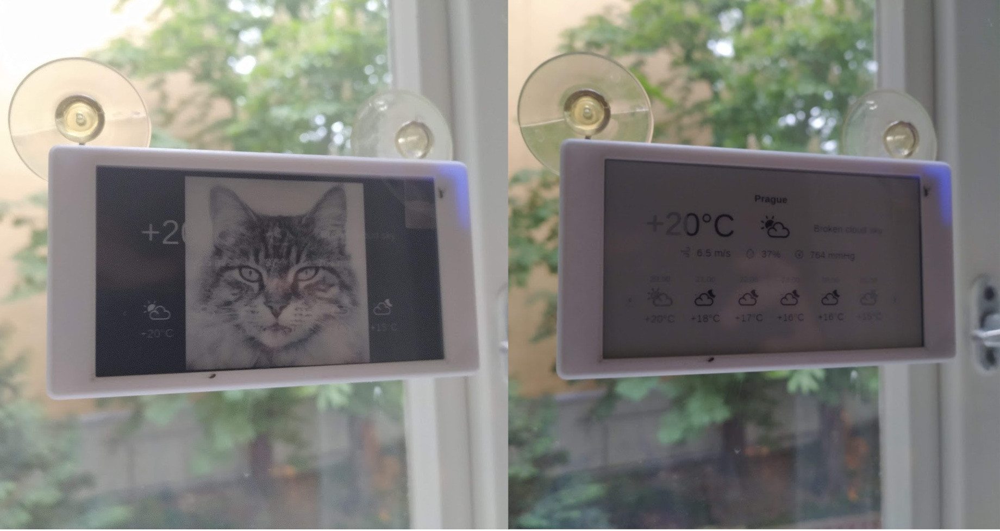

# Solar Display

A passive solar display project intended to be mounted on a window. The display fetches customizable images or html pages rendered by an azure function in regular intervals. Built with the LiliGo T5-4.7inch e-ink development board and ESP32 WROVER-E chip. Case for 3D printing with solar panel cutout is located in /case. 

## Usage

- Deploy /azure as an azure function.
- Fill in `display/src/settings.h` with wifi details, change function url.
- Flash /display to the LiliGo T5-4.7inch board using platformIO

